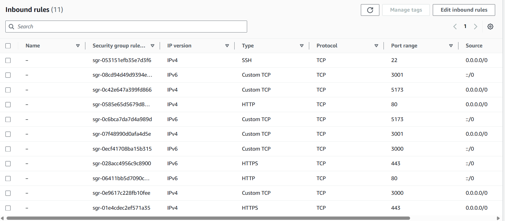

1. Create a t3 micro free tier pc in europe stockholm region(why? not mumbai) because, in stockholm t3 micro (2v cpu) available under free tier instead of t2 micro(1v cpu) in Mumbai 
2. Customize security groups and the inbound rule



3. Download key-pair and keep it inside Documents Folder
4. Right-click on key and make it read-only
5. Open any cmd Prompt and paste this command
```bat
    ssh -i 'path-to-key'/key-name.pem ubuntu@your-host-name or public ipv4 address
```
```bat
    ssh -i C:/Users/rayra/Documents/key-pair/rahul-pc-stock.pem ubuntu@ec2-51-20-52-210.eu-north-1.compute.amazonaws.com
```

6. voila! you are connected
7. type `sudo apt update`
8. type `mkdir home`
9. `cd home` and then clone git repository
10. Now the challenge is to bring npm in this machine, which can only be done using nvm(node version manager)

## Installing NPM in ubuntu-Aws

11. Go to this website `https://www.digitalocean.com/community/tutorials/how-to-install-node-js-on-ubuntu-22-04`
12. OR, Do what I am writing here -  `https://www.digitalocean.com/community/tutorials/how-to-install-node-js-on-ubuntu-22-04#option-3-installing-node-using-the-node-version-manager`
13. install version which is stable ((Latest LTS: Iron))
14. Now install pm2 `npm install -g pm2`

## Github CI/CD 
15. create a deploy.sh file in root folder in ubuntu
16. type cd and then type `vi deploy.sh`
17. Paste these command in that file
```bash
export PATH=$PATH:/home/ubuntu/.nvm/versions/node/v20.12.2/bin

cd home/MERN/100x/yimmy/backend/dist/src
 git pull origin daily-changes
 pm2 kill
 pm2 start index.js
```
18. Then press Esc button and the colon (:) and the wq
19. you have successfully created deploy.sh file
20. Now if you type `source ./deploy.sh` all the steps written in file deploy.sh run one by one
21. Now we have to create a folder .github/workflows inside this create ci.yml file `(https://github.com/FossXpert/MERN/blob/daily-changes/.github/workflows/ci.yml)`
22. Now open setting and the secrets (`https://github.com/FossXpert/MERN/settings/secrets/actions`)
23. paste the .pem key inside secrets
24. Then Connect remotely via VS code remote and open you github repo folder and type this `ssh-keyscan ec2-url >> known_hosts`
25. Push the file to github and you are done. Thanks