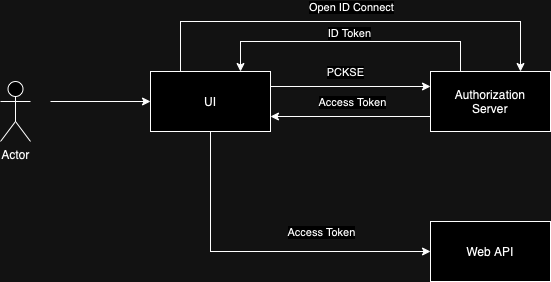

## Q1. How to send uid in Node JS

To transfer a UID (user identifier) in a Node.js application, you typically have a few options depending on your specific use case and requirements. Here are some common approaches:

1. **Using HTTP Headers**: You can include the UID in the HTTP headers of your requests. This can be done by setting a custom header like `X-UID` or `Authorization` header with the UID as a token.

2. **URL Parameters**: If the UID needs to be included in the URL itself, you can append it as a query parameter. For example: `/endpoint?uid=123`.

3. **Request Body**: If the UID is sensitive or you prefer not to expose it in the URL or headers, you can include it in the request body of POST or PUT requests. Ensure that the data is transmitted securely over HTTPS if it contains sensitive information.

4. **Cookies**: You can store the UID in an HTTP cookie and include it in subsequent requests. This approach is commonly used for session management.

5. **WebSockets**: If you're using WebSockets for real-time communication, you can include the UID in the WebSocket handshake or as part of the message payload.

Here's a simple example of how you can include the UID in the HTTP headers using Express.js:

```javascript
const express = require('express');
const app = express();

app.use((req, res, next) => {
  // Assuming uid is retrieved from the request or session
  const uid = req.user ? req.user.id : null;
  req.headers['X-UID'] = uid; // Set UID in custom header
  next();
});

// Your route handlers
app.get('/endpoint', (req, res) => {
  // Access UID from headers
  const uid = req.headers['X-UID'];
  res.send(`UID: ${uid}`);
});

app.listen(3000, () => {
  console.log('Server is running on port 3000');
});
```

In this example, the middleware function sets the UID in the `X-UID` header before passing the request to the route handlers. The route handler then accesses the UID from the headers. Adjust the implementation based on your specific requirements and the framework you're using.

## Q2. Stateless vs statefull

"Stateless" and "stateful" are terms used to describe systems, applications, or components based on whether they maintain state information.

1. **Stateless**: In a stateless system, each request from a client to the server is treated independently, without any knowledge of previous interactions. The server does not store any session information or context about the client between requests. Each request contains all the information needed for the server to process it. Stateless systems are typically more scalable and easier to manage because they do not require server-side storage of client state. HTTP is an example of a stateless protocol.

2. **Stateful**: In contrast, a stateful system maintains information about the client's session or context across multiple interactions. The server keeps track of the client's state between requests, typically using session management mechanisms such as cookies, server-side sessions, or tokens. Stateful systems can provide a more personalized and interactive experience for users, as they can remember past interactions and customize responses accordingly. However, they may be more complex to implement and scale, as they require managing and synchronizing state across distributed components.

In summary, the choice between stateless and stateful architectures depends on factors such as scalability requirements, performance considerations, security needs, and the complexity of the application. Stateless architectures are often favored for scalability and simplicity, while stateful architectures may be preferred for applications that require maintaining user sessions and personalized experiences.

## Q3. JWT Structure

JWT stands for JSON Web Token. It is a compact, URL-safe means of representing claims to be transferred between two parties. The claims in a JWT are typically used to assert information about a user or other entity and can be trusted because they are digitally signed. JWTs can be signed using a secret (with the HMAC algorithm) or a public/private key pair using RSA or ECDSA.

Here are the main components of a JWT:

1. **Header**: Contains metadata about the type of token and the cryptographic algorithms used to secure it. It typically looks like this:
   ```
   {
     "alg": "HS256",
     "typ": "JWT"
   }
   ```

2. **Payload (Claims)**: Contains the actual data being transmitted, such as user information or authorization details. It can also contain custom claims defined by the application. The payload is often encoded as a JSON object and may include standard claims defined by the JWT specification, such as `iss` (issuer), `sub` (subject), `exp` (expiration time), `aud` (audience), etc.

3. **Signature**: Used to verify that the sender of the JWT is who it says it is and to ensure that the message wasn't changed along the way. The signature is created by encoding the header and payload, concatenating them with a period (`.`) separator, and then hashing the result using a secret key or private key. This signature is included in the JWT.

JWTs are commonly used for authentication and authorization in web applications, APIs, and microservices architectures. They allow clients to authenticate themselves and access protected resources by presenting a token that encapsulates their identity and permissions. JWTs are self-contained, meaning that all the information needed for authentication and authorization is contained within the token itself, reducing the need for server-side storage and database lookups.


## Q4. ID token vs Acess Token

Access tokens and ID tokens are both types of JSON Web Tokens (JWTs) used in authentication and authorization protocols like OAuth 2.0 and OpenID Connect. While they serve different purposes, they are often used together in modern authentication systems. Here's a brief overview of each:

1. **Access Token**:
   - Purpose: Access tokens are used to authorize access to specific resources on behalf of a user. They represent the permissions granted to an application to access those resources.
   - Content: Access tokens typically contain information about the user, such as their ID, along with metadata about the token itself (e.g., expiration time).
   - Usage: Access tokens are sent with each API request to access protected resources. The server validates the access token to determine whether the request is authorized.
   - Lifespan: Access tokens are short-lived and have an expiration time. Once expired, they are no longer valid.

2. **ID Token**:
   - Purpose: ID tokens are used to authenticate users and provide information about their identity. They contain claims about the user, such as their username, email address, and other profile information.
   - Content: ID tokens typically contain user information and metadata about the token itself, similar to access tokens.
   - Usage: ID tokens are typically sent to the client application after the user successfully authenticates. They are used by the client application to verify the user's identity and make authorization decisions.
   - Lifespan: ID tokens are also short-lived and have an expiration time. However, they are not used to access protected resources directly but are instead used to obtain user information.

In summary, access tokens are used to access protected resources on behalf of a user, while ID tokens are used to authenticate users and provide information about their identity. They serve different purposes but are often used together in authentication flows to provide a comprehensive solution for authentication and authorization.