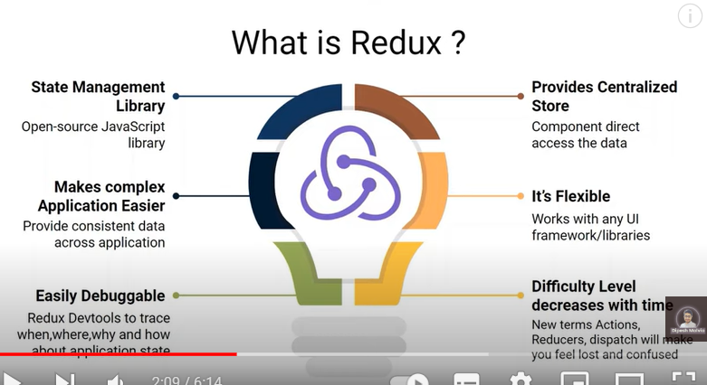
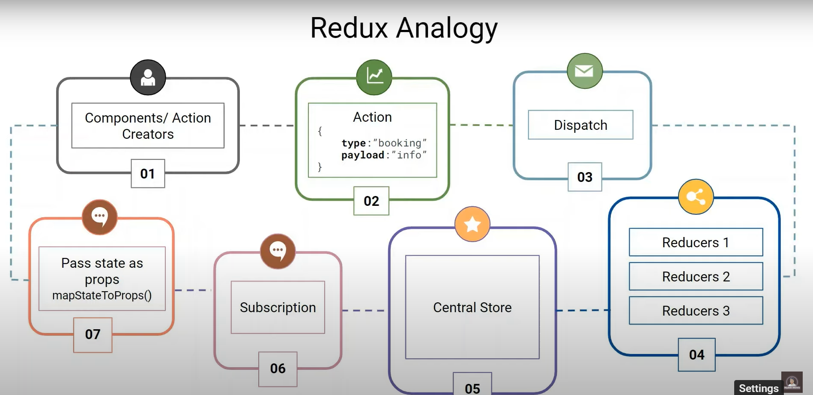

## What is Redux
- Redux is a open source javascript library for managing application state.
- Redux provide centralized store for our application state and logic.
- It give components direct access to the data they need.
- Redux is a predicatable state container, it help to write javascript apps that behave consistently across client, server and native environment

-  !! Redux Analogy !!

imagine a train ticket booking scenario
- **Action** : User request for booking a ticket (like clicking on book button)
- **Reducer** : The railway booking system (it takes the action and current state and returns a new state)
- **Store** : The central railway booking office (it holds the current state of all bookings)
- **Dispatch** : The messenger who takes the action from the user and gives it to the reducer
- **State** : The current state of all bookings (like which seats are booked, which are available)
- **Components** : The different railway stations (they receive the updated state from the store and render accordingly)
- **Connect** : The railway network (it connects the components to the store, so they can receive updates)
- **Middleware** : The railway police (it sits between the action and the reducer, and can stop or modify the action if needed)
- **Thunk** : The railway station master (it helps to handle async actions, like booking a ticket and then sending a confirmation email)
- **Selector** : The railway enquiry system (it helps to select specific data from the state, like which seats are available on a particular train)
- **Immutable** : The railway's rule of not modifying the original state, but creating a new state every time (like not modifying the original train schedule, but creating a new one every time a booking is made)

- Redux is not a framework, it's a library. It's a small library that helps you
manage your application's state in a predictable way.
- Redux is not a replacement for React, it's a complement to React. You can use Redux with React, Angular, Vue or any other framework
- Redux is not a replacement for React Context API, it's a different approach to state management.
- Redux is not a replacement for React Hooks, it's a different approach to state management.
- Redux is not a replacement for React Query, it's a different approach to data fetching and caching
- Redux is not a replacement for React Router, it's a different approach to client-side routing.